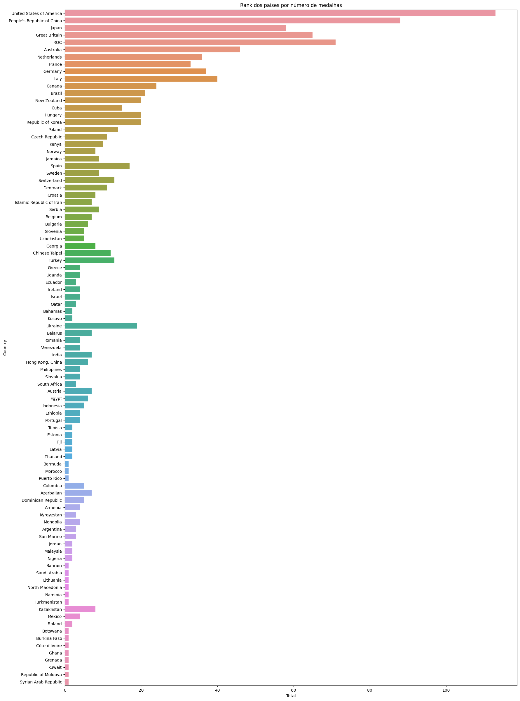
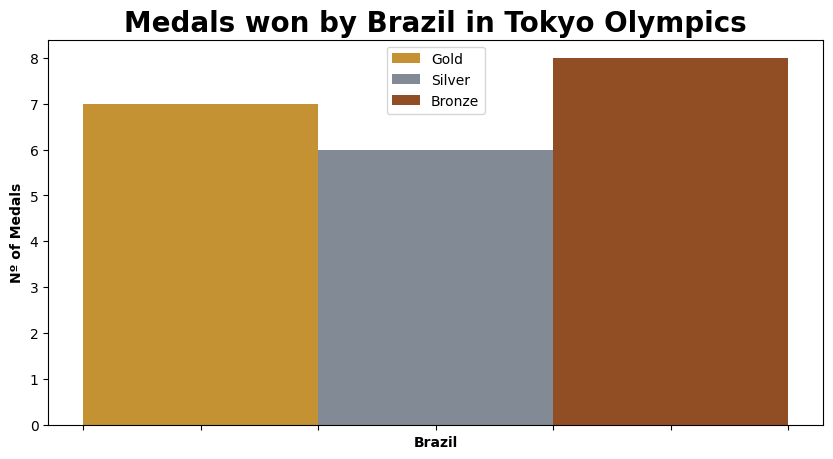
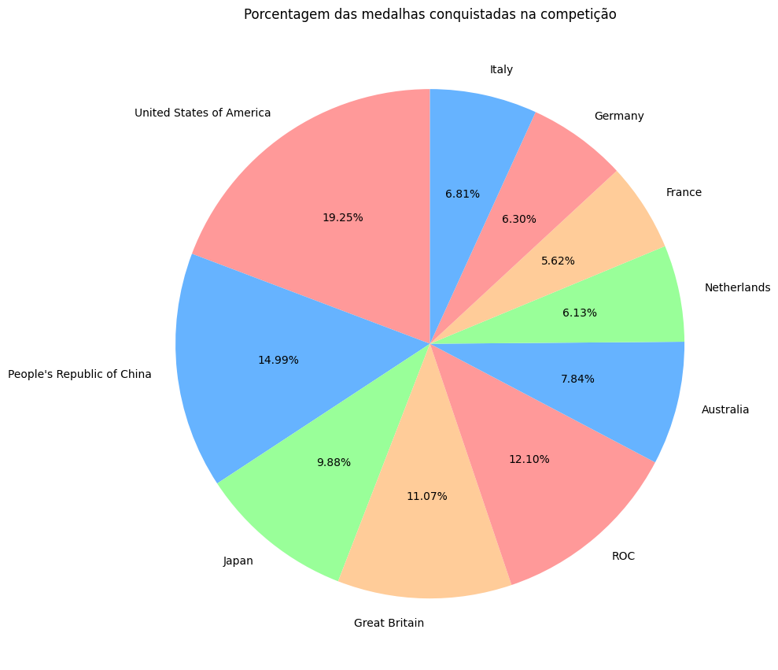

# Exploratory Data Analysis Baseado no Dataset Tokyo Olympics 2020 Medals
Desenvolvimento de um EDA baseado nos dados de medalhas obtidas nos Jogos Olímpicos de Verão de Tóquio 2020 para a aula de I.A na Fatec SJC, com objetivo de tratar dados e trazer insights interessantes sobre o assunto.


## Objetivos

- Prática com jupyter notebook
- Aprendizado com análise de dados
- Explorar e organizar dataset
- Realizar filtros para exibir insights

## Tecnologias Utilizadas: 

```Python e módulos (Pandas, matplotlib, plotly, numpy)```

## Gráficos







